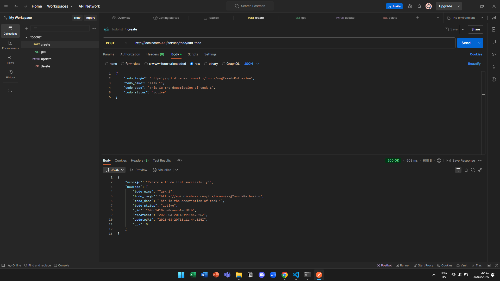
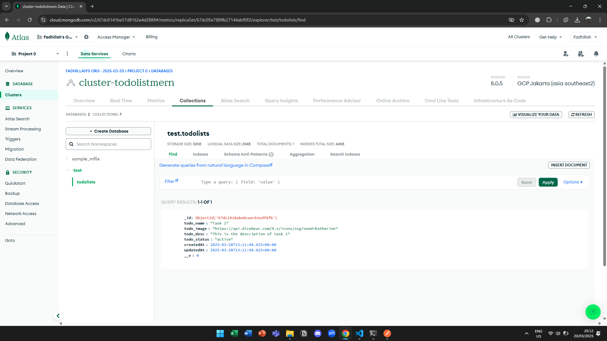
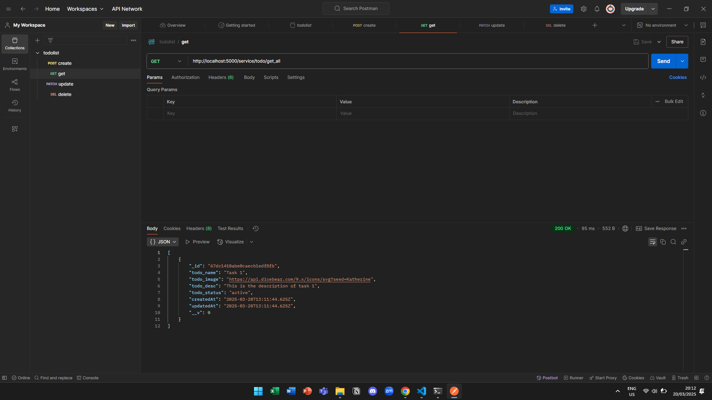
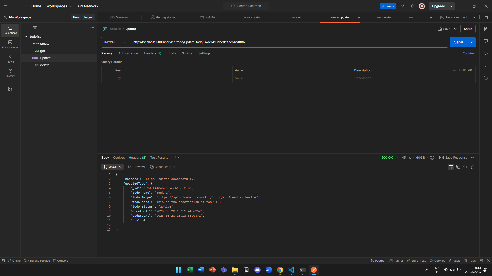
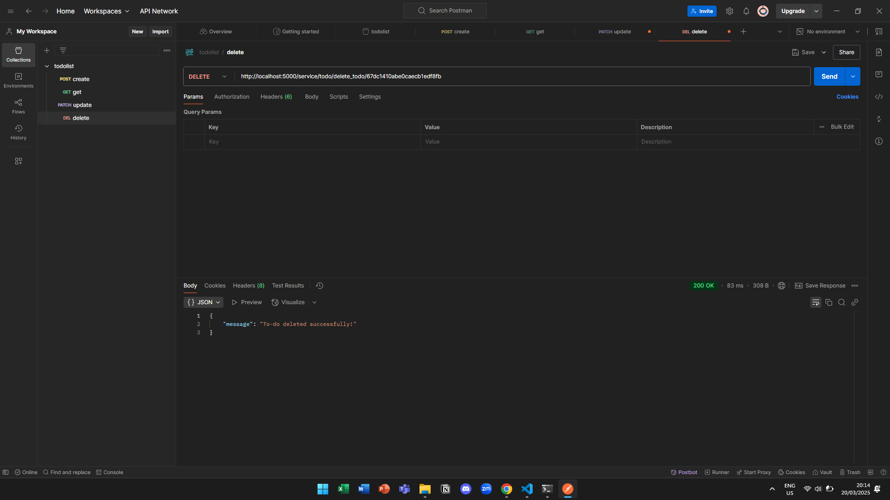
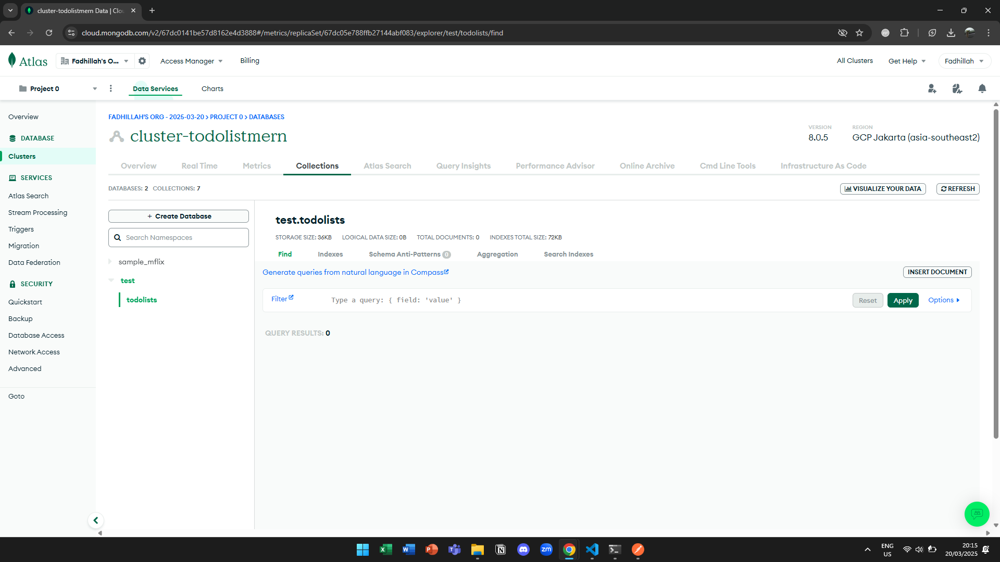

## API endpoint testings

1. Starting condition of MongoDB cluster

2. Testing POST

3. Result of POST in MongoDB cluster

4. Testing GET

5. Testing PATCH

6. Testing DELETE

7. Result of DELETE in MongoDB cluster

